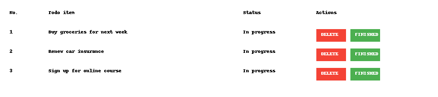

# 📋 To-Do List Web Application

A fully functional and responsive To-Do List web application built using **HTML**, **CSS**, and **JavaScript**. This app allows users to manage tasks with features like drag-and-drop reordering, due date reminders, category tagging, task search, and a light/dark theme switcher with saved preferences.

---

## 🚀 Features

- ✅ Add and remove tasks  
- 📌 Mark tasks as completed  
- 🗂️ Category tags (Work, Personal, Urgent)  
- 📅 Due date support with visual reminders  
- 🔍 Search/filter tasks by keyword  
- 📥 LocalStorage persistence (no data loss on refresh)  
- 🌓 Theme switcher (Light/Dark mode) with saved preference  
- ↕️ Drag-and-drop to reorder tasks  
- 🧼 Clean, modern UI with responsive design  

---

## 🖼️ Demo Preview

  
> *A snapshot showing task rows with action buttons and features.*

---

## 📁 Folder Structure

```
todo-app/
├── index.html        # Main HTML file
├── style.css         # Styling and themes
├── script.js         # Functionality logic
├── screenshot.png    # Demo preview image
└── README.md         # Project documentation
```


---

## 🔧 How to Run

1. **Clone or Download** this repository.
2. Open `index.html` in any modern web browser.
3. Use the app to manage your to-dos!

---

## 📦 Technologies Used

- **HTML5** – Structure  
- **CSS3** – Styling, layout, responsive design, dark/light themes  
- **JavaScript** – Interactivity, local storage, drag-and-drop, dynamic rendering  

---

## 📌 Future Enhancements (Ideas)

- Notifications for upcoming due dates  
- Export/Import task lists  
- Sub-tasks and priority levels  
- Task progress tracking  

---

## 💡 Credits

Developed by [Your Name]  
Design inspired by material UI principles.

---

## 🛡️ License

This project is licensed under the MIT License — feel free to use and modify for personal or commercial projects.
